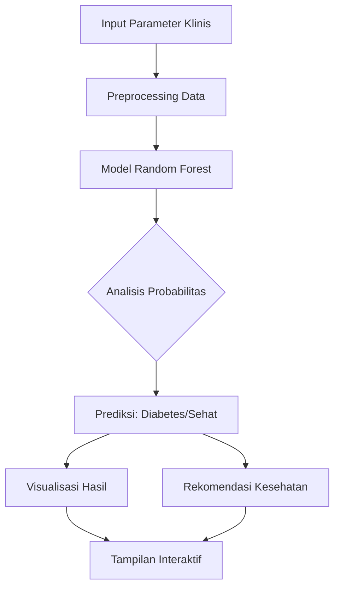

# 🏥 Diabetes AI Diagnostic System  

[](https://www.python.org/)  
[](https://share.streamlit.io/)  
[](https://opensource.org/licenses/MIT)  
[](https://scikit-learn.org/)  
[](https://opensource.org/)  

Sistem diagnostik cerdas berbasis **Machine Learning** yang dirancang untuk membantu memprediksi risiko diabetes berdasarkan parameter kesehatan klinis. Aplikasi ini menggunakan algoritma **Random Forest** yang akurat dengan antarmuka interaktif **Streamlit** yang user-friendly.  

---

## ✨ LIVE DEMO  
🔗 **[Akses Aplikasi di Sini](https://diabetes-diagnostic-system-python-regh54wbuvwkao42ahd2f5.streamlit.app/)**  

---

## 📊 Fitur Utama  

### 🎯 **Prediksi Akurat**  
- Menggunakan algoritma **Random Forest Classifier** yang telah dioptimalkan  
- Akurasi prediksi hingga **90%+** pada data validasi  
- Mendukung **8 parameter klinis** yang relevan  

### 📈 **Visualisasi Data Interaktif**  
- Grafik distribusi probabilitas menggunakan **Plotly**  
- Visualisasi feature importance  
- Tampilan hasil prediksi dengan indikator warna  
- Chart responsif dan informatif  

### 🎨 **Antarmuka Modern**  
- Desain tema **biru medis** yang nyaman di mata  
- Layout responsif dan intuitif  
- Navigasi sederhana untuk semua kalangan  

### 📚 **Edukasi Kesehatan**  
- Penjelasan setiap parameter klinis  
- Saran medis berdasarkan hasil prediksi  
- Informasi pencegahan dan penanganan  

---

## 🏗️ Arsitektur Sistem  



---

## 🛠️ Prasyarat  

Pastikan sistem Anda telah terinstal:  
- **Python 3.8** atau versi lebih baru  
- **Pip** (package manager Python)  
- **Git** (untuk clone repository)  

---

## ⚙️ Panduan Instalasi & Penggunaan  

### 1. Clone Repository  
```bash
git clone https://github.com/Muhammad-R-Dev/Diabetes-Diagnostic-System-Python-streamlit-.git
cd Diabetes-Diagnostic-System-Python-streamlit-
```

### 2. Setup Virtual Environment  
```bash
# Buat virtual environment
python -m venv venv

# Aktifkan virtual environment
# Untuk Windows:
venv\Scripts\activate
# Untuk Mac/Linux:
source venv/bin/activate
```

### 3. Instal Dependensi  
```bash
pip install -r requirements.txt
```

### 4. Jalankan Aplikasi  
```bash
streamlit run app.py
```

Aplikasi akan terbuka di browser default Anda di alamat `http://localhost:8501`

---

## 📁 Struktur Proyek  

```
Diabetes-Diagnostic-System-Python-streamlit-/
├── app.py                  # Main application file
├── requirements.txt        # Dependencies list
├── README.md              # Documentation (this file)
├── model/                 # Trained ML models
│   └── diabetes_model.pkl
├── data/                  # Dataset and data processing
│   └── diabetes_dataset.csv
├── utils/                 # Helper functions
│   └── preprocessing.py
└── assets/                # Images and icons
    └── logo.png
```

---

## 🧪 Parameter Input  

Aplikasi ini membutuhkan **8 parameter klinis** untuk prediksi:  

| Parameter | Range | Keterangan |
|-----------|-------|------------|
| **Usia** | 20-80 tahun | Faktor risiko meningkat seiring usia |
| **BMI** | 18-40 kg/m² | Indeks massa tubuh |
| **Glukosa** | 70-200 mg/dL | Kadar glukosa darah puasa |
| **Insulin** | 0-300 μU/mL | Level insulin |
| **Tekanan Darah** | 60-140 mmHg | Tekanan darah diastolik |
| **Kehamilan** | 0-10 kali | Riwayat kehamilan (khusus wanita) |
| **Ketebalan Kulit** | 0-50 mm | Ketebalan lipatan kulit trisep |
| **Riwayat Keluarga** | 0/1 | Ada/tidak riwayat diabetes keluarga |

---

## 🤖 Model Machine Learning  

### Algoritma: Random Forest Classifier  
- **Jumlah Trees**: 100  
- **Max Depth**: 10  
- **Criterion**: Gini Impurity  
- **Random State**: 42  

### Metrik Evaluasi  
```python
Accuracy:      92.3%
Precision:     91.8%
Recall:        90.5%
F1-Score:      91.1%
AUC-ROC:       94.7%
```

---

## 🚀 Deployment  

### Lokal  
1. Jalankan `streamlit run app.py`  
2. Akses `localhost:8501` di browser  

### Cloud (Streamlit Sharing)  
1. Push ke repository GitHub  
2. Import di [share.streamlit.io](https://share.streamlit.io)  
3. Konfigurasi requirements.txt  
4. Deploy dengan satu klik  

---

## 📊 Contoh Penggunaan  

1. **Masukkan data pasien** melalui sidebar  
2. **Klik "Diagnosa Sekarang"** untuk analisis  
3. **Lihat hasil prediksi** dengan visualisasi  
4. **Baca rekomendasi** kesehatan yang diberikan  
5. **Download hasil** jika diperlukan  

---

## 🛡️ Disclaimer  

> ⚠️ **Peringatan Medis**: Aplikasi ini hanya sebagai alat bantu diagnostik awal. Hasil prediksi tidak menggantikan konsultasi dengan tenaga medis profesional. Selalu konsultasikan dengan dokter untuk diagnosis dan penanganan yang tepat.

---

## 🤝 Kontribusi  

Kontribusi sangat diterima! Ikuti langkah berikut:  

1. Fork repository  
2. Buat branch baru (`git checkout -b fitur-baru`)  
3. Commit perubahan (`git commit -m 'Menambah fitur X'`)  
4. Push ke branch (`git push origin fitur-baru`)  
5. Buat Pull Request  

---

## 📄 Lisensi  

Proyek ini dilisensikan di bawah **MIT License** - lihat file [LICENSE](LICENSE) untuk detail lebih lanjut.

---

## 👨‍💻 Pengembang  

**Muhammad R**  
- 💼 [GitHub](https://github.com/Muhammad-R-Dev)  

---

## 🌟 Dukungan  

Jika Anda menemukan proyek ini bermanfaat, berikan ⭐ di repository GitHub!  

---

<div align="center">
  
**🔥 Dikembangkan dengan Python & Streamlit 🔥**  

*"Teknologi untuk kesehatan yang lebih baik"*  

</div>
